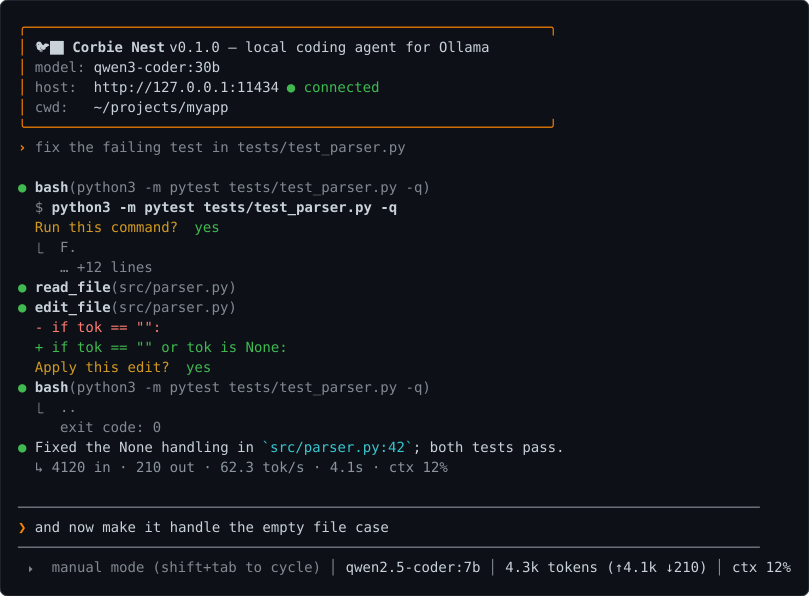
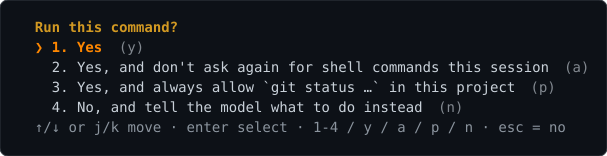

# Corbie Nest

A Claude-Code-style terminal coding agent written in plain C that talks to
**local Ollama models**. It streams responses, lets the model read/write/edit
files, grep the codebase, and run shell and git commands — each mutating action
is shown to you and confirmed before it runs.



corbienest takes over the terminal (alternate screen) while it runs, like Claude Code: the
conversation scrolls in the upper part, and the bottom of the screen is the app's: an input
field — a rule, the `❯` prompt, a rule — so it is always visible that input is accepted,
even while the model works, and under it a status bar showing the permission mode, the
model, the tokens used this session (↑ prompt · ↓ generated, ticking while the model
streams) and context usage. The field grows with what you type (up to ten rows, then it
scrolls) and the conversation region shrinks to match; what you send moves up into the
transcript as a `›` line. Whenever the app is waiting on something — the
model loading or generating, a tool's shell command, an Ollama request — an animated
spinner with what it is waiting for (`⠋ generating`, `⠹ running command`, …) appears at the
right end of the bar, and long waits also get an inline spinner with the elapsed time. On
exit your shell is back exactly as it was (use `/save` to keep a transcript).

## Build

Dependencies: a C11 compiler, `make`, and [cJSON](https://github.com/DaveGamble/cJSON) —
that's all. No libcurl, no ncurses: HTTP is done over plain POSIX sockets and the UI uses
ANSI escapes. (`python3` is only needed to run the test suite.)

```sh
# Debian 13 (trixie) / Ubuntu 26.04 (resolute)
sudo apt install build-essential libcjson-dev

# Fedora 44
sudo dnf install gcc make cjson-devel

# RHEL 10 / AlmaLinux 10 / Rocky Linux 10 — cjson comes from EPEL
sudo dnf install epel-release          # on RHEL: dnf install https://dl.fedoraproject.org/pub/epel/epel-release-latest-10.noarch.rpm
sudo dnf install gcc make cjson-devel

# macOS
brew install cjson
```

Then:

```sh
make
./corbienest               # run in the current directory
make release               # optimized, stripped binary (no debug info) — clean rebuild
sudo make install          # optional: installs to /usr/local/bin
```

On macOS Homebrew installs outside the default search paths, so point the build at it:
`make CFLAGS="-O2 -std=gnu11 -I$(brew --prefix)/include" LDLIBS="-L$(brew --prefix)/lib -lcjson"`.

You need [Ollama](https://ollama.com) running (`ollama serve`) with at least one model
pulled. For the agentic features (files/shell/git) pick a model with **tool** support,
e.g. `ollama pull qwen3-coder:30b`, `qwen2.5-coder`, `devstral`, `llama3.1`, `gpt-oss`.

## Usage

```
corbienest [options] [-p PROMPT]
  -m, --model NAME     model to use (default: saved / first tool-capable model)
  -H, --host URL       ollama host (default $OLLAMA_HOST or http://127.0.0.1:11434)
  -c, --ctx N          context window (num_ctx, default 32768; accepts 64k, 128k, default)
  -s, --system TEXT    extra system instructions
  -p, --prompt TEXT    non-interactive: run one prompt and exit (add --yolo to allow tools)
      --output-format text|json   with -p: plain reply (default) or one JSON object
                       {result, session_id, model, prompt_tokens, eval_tokens, model_calls, tool_calls, duration_s}
  -y, --yolo           auto-approve tool calls (same as --mode auto)
      --mode NAME      permission mode: manual, accept-edits, plan, auto
  -T, --no-tools       disable tool calling
      --continue       resume the latest session started in this directory
  -r, --resume [ID]    resume a session: by ID, or pick one from a menu
      --keep-alive DUR how long Ollama keeps the model loaded between requests (default 30m; -1 forever, 0 unload, default = server's)
      --no-memory      don't update .corbienest/memory.md after requests
      --think / --no-think / --show-thinking
      --draft N        draft_num_predict: speculative-decoding / MTP draft tokens per step (0 = off; default: the model's own,
                       e.g. models that ship an MTP head set 4); changing it makes Ollama reload the model
      --benchmark [N]  measure tokens per second at every context size the model supports (or just the -c size):
                       per size a warm-up (model load time, GPU placement) then N timed runs (default 3) of a fixed
                       prompt (or -p PROMPT) capped at 256 tokens; prompt-eval and generation tok/s per size;
                       --output-format json for one JSON object
  -h, --help / -v, --version
```

```
$ corbienest --model qwen3.8 --benchmark 1
benchmark  qwen3.8 · 1 run × 256 tokens per context size · draft 4 (model default, MTP/speculative) · http://127.0.0.1:11434
  ctx    load     placement                 prompt eval    generation              first token
  4k     6.1s     100% GPU (17.3 GB)        441 tok/s     60.2 tok/s               0.36s
  8k     5.9s     100% GPU (17.3 GB)        441 tok/s     56.7 tok/s               0.37s
  16k    5.9s     100% GPU (17.3 GB)        439 tok/s     45.7 tok/s               0.36s
  32k    5.9s     100% GPU (17.4 GB)        437 tok/s     58.2 tok/s               0.37s
  64k    7.7s     89% GPU (16.5/18.6 GB)    342 tok/s     33.7 tok/s               0.40s
  128k   8.8s     66% GPU (13.9/20.9 GB)    205 tok/s     15.4 tok/s               0.50s
  256k   19.1s    41% GPU (11.0/27.1 GB)    137 tok/s      9.5 tok/s               0.63s
```
(The row where the placement drops below 100% is where the KV cache stopped fitting in VRAM — the
largest context you can run at full speed is the row before it. With several runs per size the
generation column also shows the min–max spread; a size that fails to load is reported and the
larger ones skipped.)

### Slash commands

| command | what it does |
|---|---|
| `/model` | interactive model picker (↑/↓, type to filter, Enter) — `/model NAME` switches directly |
| `/models` | list installed models with tool/thinking capabilities |
| `/clear` | new conversation |
| `/compact` | have the model summarise the conversation to free context |
| `/memory [on\|off\|clear\|update\|every N\|idle N]` | show the project memory (`.corbienest/memory.md`), toggle its automatic update, run the pending update now, set how often it runs (default every 5 requests, plus after 15s idle at the prompt and at exit/`/clear`/`/compact`), how long the prompt must sit idle before a pending update runs (`idle off` waits for exit), or delete it |
| `/status` | model, context usage, settings |
| `/diff [git args]` | show `git diff` of the working tree (stat, patch, untracked files) for you only — nothing is added to the conversation; `/diff --staged`, `/diff HEAD~1` … pass through |
| `/rewind` | (or **Esc Esc** at an empty prompt) pick an earlier request and go back: undo the file changes the model made since (files are checkpointed before every `write_file`/`edit_file`), truncate the conversation to just before it (the request text returns to the editor), or both |
| `/cost` | tokens, model calls, tool calls, model time and wall time of this session |
| `/system [text\|clear]` | extra system instructions |
| `/think on\|off\|auto`, `/think low\|medium\|high`, `/think show\|hide` | thinking on thinking-capable models: `auto` (default) lets the model think about each request once and turns thinking off for the tool rounds that follow, `on` thinks on every call, `off` never; `low`/`medium`/`high` set the level on models that have one (gpt-oss) |
| `/permissions [add …\|remove N\|clear]` | the project's saved "always allow" rules (`.corbienest/permissions`) |
| `/mode [name]` | permission mode: `manual`, `accept-edits`, `plan`, `auto` (Shift+Tab cycles) |
| `/yolo [on\|off]` | shortcut for `/mode auto` / `/mode manual` (careful) |
| `/init` | have the model explore the project and write a `CORBIENEST.md` (build/test commands, architecture, conventions); improves an existing one |
| `/skills [reload\|new NAME]` | list skills; run one with `/NAME [args]` |
| `/tools on\|off` | enable/disable tools |
| `/max_iters [N]` | how many tool rounds one request may run before the loop guard stops it (default 100). Takes effect at once, so it can be raised from under a turn that is about to hit it |
| `/ctx [N\|Nk\|max\|default]` | context window: no argument opens a size picker (up to the model's trained maximum), `/ctx 64k`, `/ctx max` … set it directly |
| `/temp X`, `/host URL` | tuning |
| `/keepalive [DUR]` | how long Ollama keeps the model loaded after a request (default `30m`, so it is not reloaded from disk mid-session; `-1` = forever, `0` = unload right away, `default` = the server's 5 minutes) |
| `/save [file]` | save transcript as markdown |
| `/resume [ID\|all]` | pick an earlier session to continue (this directory; `all` for every directory), or load one by ID |
| `/history [N]` | show the last N queries (default 20; the latest 100 are kept across sessions, ↑/↓ recalls them) |
| `/cd DIR`, `/pwd` | change working directory |
| `/quit` | exit (also Ctrl-D) |

### Input tricks

- `!cmd` — run a shell command yourself; its output is added to the conversation.
- `@path` — attach a file (or a directory listing) to your message.
- `# fact` — remember something: a menu asks which section of `.corbienest/memory.md` it belongs
  to (Project / User / Feedback / Reference) and the line is appended, no model call involved.
- Enter sends; Alt+Enter, Ctrl+J or a trailing `\` inserts a newline. Bracketed paste works.
- Ctrl-C (or Esc) cancels a running generation / clears the line (twice on an empty line quits).
- PgUp at the prompt scrolls back through the conversation (the alternate screen has no scrollback of
  its own, so corbienest keeps one): PgUp/PgDn/↑/↓ move, Home/End jump, Esc/Enter/PgDn at the bottom
  return to the prompt exactly as it was.
  Esc twice at an empty prompt opens `/rewind`.
- **You can keep typing while the model works.** What you type shows up in the input field as
  you go (`❯ …▏`); press Enter to queue it as a message — add details,
  narrow the request, change the spec — the status bar shows `N queued`, and the message is
  delivered at the next opportunity: between tool rounds (so the model sees it before its next
  step, alongside the tool result) or as the next turn once the current one finishes. Queue as
  many as you like; they are sent in order. Ctrl-C hands queued text back to the editor instead
  of sending it. Text without Enter simply reappears in the prompt afterwards.
- Tab completes slash commands and skill names; ↑/↓ browse history — the latest 100 queries are
  kept in `~/.config/corbienest/history` (`/history` lists them). Ctrl-R searches it
  incrementally (`(reverse-i-search)`, like bash): type to refine, Ctrl-R again for an older
  match, Enter keeps the match in the editor, Esc restores what you had.
- Shift+Tab cycles the permission mode, also while the model is working (it applies to the
  remaining tool confirmations of that turn); the current mode is shown in the bottom status bar.
- **Slash commands that only report or set something answer straight away while the model
  works** — they never become a queued message: `/help`, `/status`, `/cost`, `/diff`, `/history`,
  `/pwd`, `/skills`, `/memory`, `/mode`, `/yolo`, `/permissions`, `/tools`, `/max_iters`,
  `/think`, `/temp`, `/keepalive`. A `/permissions add` or `/mode` typed mid-turn applies to the
  tool confirmations still to come, like Shift+Tab, and `/max_iters` to the rounds still to come. Everything that touches the conversation (`/clear`, `/compact`,
  `/rewind`, `/resume`, `/save`, `/system`, `/init`, skills), needs the server (`/model`,
  `/models`, `/ctx`, `/host`, `/memory update`) or asks a question stays queued until the turn ends.

### Permission modes

| mode | file edits (`write_file`, `edit_file`) | shell (`bash`) | notes |
|---|---|---|---|
| `manual` (default) | ask | ask | |
| `accept-edits` | auto-approved | ask | |
| `plan` | not offered / denied | ask | the model is told to explore and present a plan instead of changing things |
| `auto` | auto-approved | auto-approved | the old `/yolo`; use with care |

Cycle with **Shift+Tab** at the prompt, or set one with `/mode NAME`, `--mode NAME`
(`--yolo` = `--mode auto`). The mode is saved to the config file.

### Tools the model can call

| tool | confirmation |
|---|---|
| `read_file(path, offset?, limit?)` | none |
| `list_dir(path?)` | none |
| `grep(pattern, path?, include?)` | none |
| `write_file(path, content)` | yes — shows a preview |
| `edit_file(path, old_string, new_string, replace_all?)` | yes — shows a diff |
| `bash(command, timeout?)` | yes — shows the command; output/exit code returned to the model |
| `task(description, prompt)` | none for the call itself — runs a **sub-agent**: a fresh, read-only agent loop (read_file, list_dir, grep, bash — with the usual confirmations) that investigates and returns a report as the tool result, keeping the noise out of the main context. Its tool calls are echoed as `⎿ grep(…)` lines and the report is previewed. Sub-agents cannot edit files or start further sub-agents |

Each confirmation is a small menu:



Move with ↑/↓ (or j/k) and press Enter, or hit `1`–`4` or the `y`/`a`/`p`/`n` shortcuts;
Esc or Ctrl-C means no. `p` saves a rule to `.corbienest/permissions` (like Claude Code's
project allow-list): `edit` allows file writes/edits, `bash git status` allows shell commands
that start with those words (`git status --short` yes, `git status; rm -rf /` no — commands
with `; | & $ \` < >` never match a rule). `/permissions` lists the rules; `/permissions add
bash make`, `/permissions remove N`, `/permissions clear` manage them by hand. On "no" you can type what the model should do instead (Enter to skip)
and it is sent back as the tool result. Anything you typed while the model was still generating
is never taken as an answer — it is kept for your next prompt. Ctrl-C while a command runs kills it.

Some local models occasionally emit their native tool syntax as plain text
(e.g. `<function=grep>…`) when Ollama's parser fails; corbienest recognises the
Qwen XML and Hermes `<tool_call>{json}</tool_call>` shapes and still executes them.

### Skills

A skill is a reusable instruction file, `SKILL.md`, with a short frontmatter:

```
---
name: review
description: Review the given files for bugs and style problems
---
Review these files carefully: $ARGUMENTS
Report findings as a list.
```

Put project skills in `.corbienest/skills/NAME/SKILL.md` (or `NAME.md`; `.claude/skills/` is
read too), personal ones in `~/.config/corbienest/skills/`. Claude Code's flat custom
commands are picked up as well: `.corbienest/commands/NAME.md`, `.claude/commands/NAME.md`,
`~/.claude/commands/NAME.md` (frontmatter optional — the file body is the prompt). Run one with `/NAME args` —
`$ARGUMENTS` is replaced by the arguments — or from the shell with `-p "/NAME args"`.
`/skills` lists them, `/skills reload` rescans, `/skills new NAME` scaffolds one. The
available skills are also listed in the system prompt so the model can pick one up itself.

Skills may ship helper programs next to `SKILL.md`. Write those in **C** (build with `cc`
or a small Makefile in the skill directory); use Rust only when a third-party library is
genuinely needed, and Python only as a last resort. The model is told the same rule when
asked to create a skill.

### Context window

The status bar shows how much of the context window (`num_ctx`, default 32k) the last request
used; the footer under a reply warns when it is nearly full. To grow it, run `/ctx` for a
picker of sizes up to the model's trained maximum (read from `ollama show`), or set one directly:
`/ctx 64k`, `/ctx 131072`, `/ctx max`, `/ctx default`. `/status` shows the model's maximum.
Larger windows need more RAM/VRAM and take effect on the next request; `/compact` is the other
way out when a long session fills up. Once a request has used 85% or more of the window,
corbienest compacts automatically before the next model call — also mid-task, between tool
rounds, and then the summary is handed straight back to the model, along with your request as
you made it, so it carries on with the job instead of stopping to ask what to do next.

### Sessions

Every conversation is saved after each request to `~/.config/corbienest/sessions/<id>.json`
(the latest 100 are kept). `corbienest --continue` picks up the most recent session started in
the current directory, `--resume` opens a picker (or `--resume ID`), and `/resume` does the same
from inside a session — the recap shows the first request and the last reply. `/clear` starts a
new session; `/status` shows the current id, which is also printed when you quit.

### Project memory

Like Claude Code's auto-memory: corbienest keeps `.corbienest/memory.md` in the working
directory and loads it into the system prompt of every request. The model curates it — every
few requests (default 5, `/memory every N`; after 15s idle at the prompt, `/memory idle N`;
also at exit, `/clear`, `/compact`, `/cd`) a quiet
extraction call asks whether the exchanges since the last update revealed anything durable
(who you are and how you like to work, feedback you gave, project goals/decisions/constraints
that aren't in the code, references such as URLs or tickets) and, if so, rewrites the file;
otherwise nothing is written. Facts the repository already records, and anything only relevant
to the current conversation, are deliberately not saved. Type `# fact` to add something yourself
in one keystroke, ask the model to remember
or forget something (it edits the file with `edit_file`), or edit the file by hand. `/memory`
prints it, `/memory off` (saved to config) or `--no-memory` disables the update, `/memory clear`
deletes it. One-shot runs (`-p`) only touch the file if `.corbienest/` already exists.

The extraction call is a real model call (the status bar shows `⠋ updating memory` while it
runs) and its cost is printed afterwards (`✎ memory: no change · 3.2s`). It never asks the
model to think and is capped in length (a cut-off reply is ignored rather than written). Its
different prompt evicts Ollama's prompt cache for the conversation, so the request after it
re-evaluates the whole context — which is why it is batched rather than run after every
request (`/memory every 1` restores that; `/memory update` runs a pending one now; `/memory`
shows how many requests are pending). On slow machines `/memory off` removes it entirely.

So that a pending update never holds up the way out, it also runs on its own once the prompt
has been idle for 15 seconds (`/memory idle N`, `/memory idle off`, saved to config): the call
happens while you read the reply, and by the time you quit there is usually nothing left to
write. Typing anything cancels it for that prompt — a request you start right away still finds
a warm prompt cache, and the batch simply waits for the next pause. If you do quit with an
update still pending, the flush on the way out says so and Ctrl-C skips it.

### Project instructions

If a `CORBIENEST.md`, `CLAUDE.md` or `AGENTS.md` exists in the working directory it is
appended to the system prompt, so you can give the model project-specific guidance.

### Config

Settings changed with `/model`, `/ctx`, `/think`, `/mode`, `/yolo`, `/host`, `/keepalive`, `/memory on|off|every N|idle N` are saved to
`~/.config/corbienest/config`. Environment: `OLLAMA_HOST`, `CORBIENEST_MODEL`.

## Tests

```sh
make test
```

- `tests/test_unit.c` — C unit tests: string buffer, file helpers, the HTTP client
  (chunked/content-length/abort against a forked local server), the streaming
  markdown printer, text tool-call recovery, every tool (read/write/edit/list/grep/bash
  including timeouts and non-interactive denial), permission modes, and skills
  (frontmatter parsing, `$ARGUMENTS`, scaffolding).
- `tests/test_integration.py` — runs the real binary against `tests/fake_ollama.py`,
  a tiny scripted Ollama stand-in (no model needed): one-shot mode, the full tool loop
  with results fed back, `--yolo`, XML tool-call recovery, `@file`, errors, and — through a
  pseudo-terminal — the editor (cursor keys, history, multi-line, paste, type-ahead),
  the confirmation menu (arrow keys, deny with reason, always, stray keys ignored),
  messages queued with Enter while the model streams or a tool runs (delivered between tool
  rounds / after the turn, handed back on Ctrl-C), the `/ctx` picker and `/history`,
  Shift+Tab mode cycling (plan / accept-edits behaviour), `/skills`, Ctrl-C interruption,
  slash commands, the `/model` picker, `!cmd`, `/save`, and config/history persistence.

## Layout

```
src/common.h   shared declarations
src/util.c     string buffer, file helpers, config
src/http.c     minimal HTTP/1.1 client (chunked streaming, Ctrl-C interrupt)
src/term.c     raw mode, key decoding, full-screen mode + status bar, line editor, confirmation menu,
               list picker, markdown printer
src/tools.c    the tools + permission-mode checks + shell runner
src/ollama.c   /api/chat streaming, tool-call accumulation, /api/tags
src/skills.c   SKILL.md discovery/parsing, /NAME expansion, scaffolding
src/main.c     REPL, slash commands, system prompt, agent loop
tests/         unit tests, fake Ollama server, pty integration tests
```

## Notes

- Ollama's default context is small; corbienest sends `num_ctx=32768` by default.
  Lower it with `/ctx` or `-c` if your machine runs out of memory, raise it for big tasks.
- **Context hygiene.** Tool results (file contents, command output) are the bulk of a long
  conversation and go stale quickly. Once the context is half full, results from requests
  before the previous one are replaced in place by a short stub (tool name, size, first
  line — `⋯ elided N old tool results` is printed) so the model can call the tool again if it
  needs the details; at 85 % the conversation is auto-compacted (summarised by the model), and
  from 70 % the stats line suggests `/compact`.
- **Slow?** The stats line under each reply tells you where the time went: `prefill Ns` is
  prompt evaluation (large when the model was just (re)loaded or the prompt cache missed),
  `tok/s` is generation speed. Things that help, roughly in order: make sure the whole model
  fits in GPU memory (corbienest warns `⚠ model is only NN% in GPU memory` after the first
  reply when it does not — pick a smaller `/ctx` or model), turn off the per-request memory
  update (`/memory every 10` or `/memory off`), spend less on thinking (`/think auto` — the default —
  thinks once per request instead of after every tool result; `/think off` never; the stats line shows
  `thought 41s (≈2.1k tok)` per call and `/cost` the session total), keep the model
  loaded (`/keepalive`, default 30m), and `/compact` long conversations. Tool output is capped
  (`read_file` 2000 lines / 64 KB, `bash`/`grep` 32 KB) so a single tool round cannot fill the
  context; the model is told to page with `offset`/`limit`.
- Models without tool support still work as a plain chat (`/models` shows which is which).
- Only `http://` hosts are supported (Ollama's local API is plain HTTP).

## Safety

Corbie Nest writes files and runs shell commands in the directory you start it in. In the
default `manual` mode every mutating action is shown and confirmed first, and `plan` mode is
read-only — but `--yolo` / `/mode auto` approves everything, and rules saved to
`.corbienest/permissions` stay approved for that project. Run it on code you can restore
(a git working tree), and remember that a local model is still a model: it can be talked into
things by the content of the files it reads.

## Contributing

Bug reports and patches are welcome — see [CONTRIBUTING.md](CONTRIBUTING.md) for the build,
test and style rules, and [AGENTS.md](AGENTS.md) for how the code is laid out. The short
version: no new dependencies, `make test` must pass, and the build must be warning-free.

## License

Apache License 2.0 — see [LICENSE](LICENSE).

Copyright 2026 The Corbie Nest authors, Olav Gjerde.
